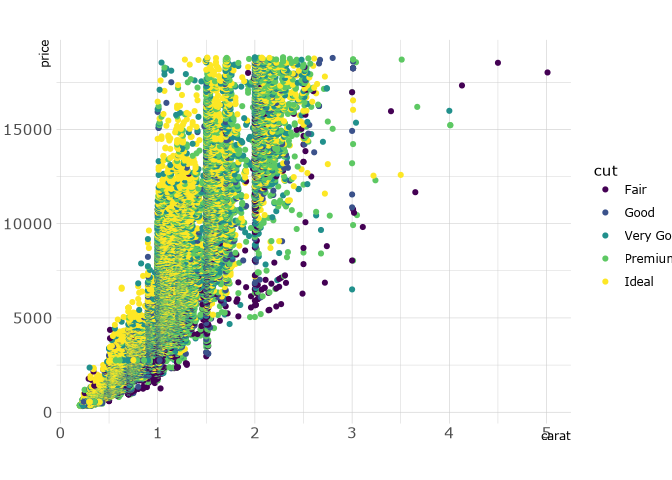

<!-- README.md is generated from README.Rmd. Please edit that file -->

# Atropos Theme

<!-- badges: start -->

<!-- badges: end -->

The goal of this library is to provide a centralized repository to
create graphs in the style of Atropos Health for deliverables.

## Installation

You can install the development version of `atropos` like so:

``` r
devtools::install_github("atroposhealth/ratropostheme")
```

## Example

This is a basic example which shows you how to solve a common problem:

``` r
diamonds %>% 
  ggplot(aes(x = carat, y = price, color = cut)) +
  geom_point() +
  theme_atropos()
#> Warning in grid.Call(C_stringMetric, as.graphicsAnnot(x$label)): no font could
#> be found for family "Lato"
#> Warning in grid.Call(C_stringMetric, as.graphicsAnnot(x$label)): no font could
#> be found for family "Lato"
#> Warning in grid.Call(C_stringMetric, as.graphicsAnnot(x$label)): no font could
#> be found for family "Lato"
#> Warning in grid.Call(C_stringMetric, as.graphicsAnnot(x$label)): no font could
#> be found for family "Lato"
#> Warning in grid.Call(C_stringMetric, as.graphicsAnnot(x$label)): no font could
#> be found for family "Lato"
#> Warning in grid.Call(C_stringMetric, as.graphicsAnnot(x$label)): no font could
#> be found for family "Lato"
#> Warning in grid.Call(C_stringMetric, as.graphicsAnnot(x$label)): no font could
#> be found for family "Lato"
#> Warning in grid.Call(C_stringMetric, as.graphicsAnnot(x$label)): no font could
#> be found for family "Lato"
#> Warning in grid.Call(C_stringMetric, as.graphicsAnnot(x$label)): no font could
#> be found for family "Lato"
#> Warning in grid.Call(C_stringMetric, as.graphicsAnnot(x$label)): no font could
#> be found for family "Lato"
#> Warning in grid.Call(C_stringMetric, as.graphicsAnnot(x$label)): no font could
#> be found for family "Lato"
#> Warning in grid.Call(C_stringMetric, as.graphicsAnnot(x$label)): no font could
#> be found for family "Lato"
#> Warning in grid.Call(C_stringMetric, as.graphicsAnnot(x$label)): no font could
#> be found for family "Lato"
#> Warning in grid.Call(C_stringMetric, as.graphicsAnnot(x$label)): no font could
#> be found for family "Lato"
#> Warning in grid.Call(C_textBounds, as.graphicsAnnot(x$label), x$x, x$y, : no
#> font could be found for family "Lato"
#> Warning in grid.Call(C_textBounds, as.graphicsAnnot(x$label), x$x, x$y, :
#> Unable to calculate text width/height (using zero)
#> Warning in grid.Call(C_textBounds, as.graphicsAnnot(x$label), x$x, x$y, : no
#> font could be found for family "Lato"
#> Warning in grid.Call(C_textBounds, as.graphicsAnnot(x$label), x$x, x$y, :
#> Unable to calculate text width/height (using zero)
#> Warning in grid.Call(C_textBounds, as.graphicsAnnot(x$label), x$x, x$y, : no
#> font could be found for family "Lato"
#> Warning in grid.Call(C_textBounds, as.graphicsAnnot(x$label), x$x, x$y, :
#> Unable to calculate text width/height (using zero)
#> Warning in grid.Call(C_textBounds, as.graphicsAnnot(x$label), x$x, x$y, : no
#> font could be found for family "Lato"
#> Warning in grid.Call(C_textBounds, as.graphicsAnnot(x$label), x$x, x$y, :
#> Unable to calculate text width/height (using zero)
#> Warning in grid.Call(C_textBounds, as.graphicsAnnot(x$label), x$x, x$y, : no
#> font could be found for family "Lato"
#> Warning in grid.Call(C_textBounds, as.graphicsAnnot(x$label), x$x, x$y, :
#> Unable to calculate text width/height (using zero)
#> Warning in grid.Call(C_textBounds, as.graphicsAnnot(x$label), x$x, x$y, : no
#> font could be found for family "Lato"
#> Warning in grid.Call(C_textBounds, as.graphicsAnnot(x$label), x$x, x$y, :
#> Unable to calculate text width/height (using zero)
#> Warning in grid.Call(C_textBounds, as.graphicsAnnot(x$label), x$x, x$y, : no
#> font could be found for family "Lato"
#> Warning in grid.Call(C_textBounds, as.graphicsAnnot(x$label), x$x, x$y, :
#> Unable to calculate text width/height (using zero)
#> Warning in grid.Call(C_textBounds, as.graphicsAnnot(x$label), x$x, x$y, : no
#> font could be found for family "Lato"
#> Warning in grid.Call(C_textBounds, as.graphicsAnnot(x$label), x$x, x$y, :
#> Unable to calculate text width/height (using zero)
#> Warning in grid.Call(C_textBounds, as.graphicsAnnot(x$label), x$x, x$y, : no
#> font could be found for family "Lato"
#> Warning in grid.Call(C_textBounds, as.graphicsAnnot(x$label), x$x, x$y, :
#> Unable to calculate text width/height (using zero)
#> Warning in grid.Call(C_textBounds, as.graphicsAnnot(x$label), x$x, x$y, : no
#> font could be found for family "Lato"
#> Warning in grid.Call(C_textBounds, as.graphicsAnnot(x$label), x$x, x$y, :
#> Unable to calculate text width/height (using zero)
#> Warning in grid.Call(C_stringMetric, as.graphicsAnnot(x$label)): no font could
#> be found for family "Lato"
#> Warning in grid.Call(C_stringMetric, as.graphicsAnnot(x$label)): no font could
#> be found for family "Lato"
#> Warning in grid.Call(C_stringMetric, as.graphicsAnnot(x$label)): no font could
#> be found for family "Lato"
#> Warning in grid.Call(C_stringMetric, as.graphicsAnnot(x$label)): no font could
#> be found for family "Lato"
#> Warning in grid.Call(C_stringMetric, as.graphicsAnnot(x$label)): no font could
#> be found for family "Lato"
#> Warning in grid.Call(C_stringMetric, as.graphicsAnnot(x$label)): no font could
#> be found for family "Lato"
#> Warning in grid.Call(C_stringMetric, as.graphicsAnnot(x$label)): no font could
#> be found for family "Lato"
#> Warning in grid.Call(C_stringMetric, as.graphicsAnnot(x$label)): no font could
#> be found for family "Lato"
#> Warning in grid.Call(C_stringMetric, as.graphicsAnnot(x$label)): no font could
#> be found for family "Lato"
#> Warning in grid.Call(C_stringMetric, as.graphicsAnnot(x$label)): no font could
#> be found for family "Lato"
#> Warning in grid.Call(C_stringMetric, as.graphicsAnnot(x$label)): no font could
#> be found for family "Lato"
#> Warning in grid.Call(C_stringMetric, as.graphicsAnnot(x$label)): no font could
#> be found for family "Lato"
#> Warning in grid.Call(C_stringMetric, as.graphicsAnnot(x$label)): no font could
#> be found for family "Lato"
#> Warning in grid.Call(C_stringMetric, as.graphicsAnnot(x$label)): no font could
#> be found for family "Lato"
#> Warning in grid.Call(C_stringMetric, as.graphicsAnnot(x$label)): no font could
#> be found for family "Lato"
#> Warning in grid.Call(C_stringMetric, as.graphicsAnnot(x$label)): no font could
#> be found for family "Lato"
#> Warning in grid.Call(C_stringMetric, as.graphicsAnnot(x$label)): no font could
#> be found for family "Lato"
#> Warning in grid.Call(C_stringMetric, as.graphicsAnnot(x$label)): no font could
#> be found for family "Lato"
#> Warning in grid.Call(C_stringMetric, as.graphicsAnnot(x$label)): no font could
#> be found for family "Lato"
#> Warning in grid.Call(C_stringMetric, as.graphicsAnnot(x$label)): no font could
#> be found for family "Lato"
#> Warning in grid.Call(C_stringMetric, as.graphicsAnnot(x$label)): no font could
#> be found for family "Lato"
#> Warning in grid.Call(C_stringMetric, as.graphicsAnnot(x$label)): no font could
#> be found for family "Lato"
#> Warning in grid.Call(C_stringMetric, as.graphicsAnnot(x$label)): no font could
#> be found for family "Lato"
#> Warning in grid.Call(C_stringMetric, as.graphicsAnnot(x$label)): no font could
#> be found for family "Lato"
#> Warning in grid.Call(C_stringMetric, as.graphicsAnnot(x$label)): no font could
#> be found for family "Lato"
#> Warning in grid.Call(C_stringMetric, as.graphicsAnnot(x$label)): no font could
#> be found for family "Lato"
#> Warning in grid.Call(C_stringMetric, as.graphicsAnnot(x$label)): no font could
#> be found for family "Lato"
#> Warning in grid.Call(C_stringMetric, as.graphicsAnnot(x$label)): no font could
#> be found for family "Lato"
#> Warning in grid.Call(C_textBounds, as.graphicsAnnot(x$label), x$x, x$y, : no
#> font could be found for family "Lato"
#> Warning in grid.Call(C_textBounds, as.graphicsAnnot(x$label), x$x, x$y, :
#> Unable to calculate text width/height (using zero)
#> Warning in grid.Call(C_textBounds, as.graphicsAnnot(x$label), x$x, x$y, : no
#> font could be found for family "Lato"
#> Warning in grid.Call(C_textBounds, as.graphicsAnnot(x$label), x$x, x$y, :
#> Unable to calculate text width/height (using zero)
#> Warning in grid.Call(C_textBounds, as.graphicsAnnot(x$label), x$x, x$y, : no
#> font could be found for family "Lato"
#> Warning in grid.Call(C_textBounds, as.graphicsAnnot(x$label), x$x, x$y, :
#> Unable to calculate text width/height (using zero)
#> Warning in grid.Call(C_textBounds, as.graphicsAnnot(x$label), x$x, x$y, : no
#> font could be found for family "Lato"
#> Warning in grid.Call(C_textBounds, as.graphicsAnnot(x$label), x$x, x$y, :
#> Unable to calculate text width/height (using zero)
#> Warning in grid.Call(C_textBounds, as.graphicsAnnot(x$label), x$x, x$y, : no
#> font could be found for family "Lato"
#> Warning in grid.Call(C_textBounds, as.graphicsAnnot(x$label), x$x, x$y, :
#> Unable to calculate text width/height (using zero)
#> Warning in grid.Call(C_textBounds, as.graphicsAnnot(x$label), x$x, x$y, : no
#> font could be found for family "Lato"
#> Warning in grid.Call(C_textBounds, as.graphicsAnnot(x$label), x$x, x$y, :
#> Unable to calculate text width/height (using zero)
#> Warning in grid.Call(C_textBounds, as.graphicsAnnot(x$label), x$x, x$y, : no
#> font could be found for family "Lato"
#> Warning in grid.Call(C_textBounds, as.graphicsAnnot(x$label), x$x, x$y, :
#> Unable to calculate text width/height (using zero)
#> Warning in grid.Call(C_textBounds, as.graphicsAnnot(x$label), x$x, x$y, : no
#> font could be found for family "Lato"
#> Warning in grid.Call(C_textBounds, as.graphicsAnnot(x$label), x$x, x$y, :
#> Unable to calculate text width/height (using zero)
#> Warning in grid.Call(C_textBounds, as.graphicsAnnot(x$label), x$x, x$y, : no
#> font could be found for family "Lato"
#> Warning in grid.Call(C_textBounds, as.graphicsAnnot(x$label), x$x, x$y, :
#> Unable to calculate text width/height (using zero)
#> Warning in grid.Call(C_textBounds, as.graphicsAnnot(x$label), x$x, x$y, : no
#> font could be found for family "Lato"
#> Warning in grid.Call(C_textBounds, as.graphicsAnnot(x$label), x$x, x$y, :
#> Unable to calculate text width/height (using zero)
#> Warning in grid.Call(C_textBounds, as.graphicsAnnot(x$label), x$x, x$y, : no
#> font could be found for family "Lato"
#> Warning in grid.Call(C_textBounds, as.graphicsAnnot(x$label), x$x, x$y, : no
#> font could be found for family "Lato"
#> Warning in grid.Call(C_textBounds, as.graphicsAnnot(x$label), x$x, x$y, :
#> Unable to calculate text width/height (using zero)
#> Warning in grid.Call(C_textBounds, as.graphicsAnnot(x$label), x$x, x$y, : no
#> font could be found for family "Lato"
#> Warning in grid.Call(C_textBounds, as.graphicsAnnot(x$label), x$x, x$y, :
#> Unable to calculate text width/height (using zero)
#> Warning in grid.Call(C_textBounds, as.graphicsAnnot(x$label), x$x, x$y, : no
#> font could be found for family "Lato"
#> Warning in grid.Call(C_textBounds, as.graphicsAnnot(x$label), x$x, x$y, : no
#> font could be found for family "Lato"
#> Warning in grid.Call(C_textBounds, as.graphicsAnnot(x$label), x$x, x$y, :
#> Unable to calculate text width/height (using zero)
#> Warning in grid.Call(C_textBounds, as.graphicsAnnot(x$label), x$x, x$y, : no
#> font could be found for family "Lato"
#> Warning in grid.Call(C_textBounds, as.graphicsAnnot(x$label), x$x, x$y, :
#> Unable to calculate text width/height (using zero)
#> Warning in grid.Call.graphics(C_text, as.graphicsAnnot(x$label), x$x, x$y, : no
#> font could be found for family "Lato"
#> Warning in grid.Call.graphics(C_text, as.graphicsAnnot(x$label), x$x, x$y, : no
#> font could be found for family "Lato"
#> Warning in grid.Call.graphics(C_text, as.graphicsAnnot(x$label), x$x, x$y, : no
#> font could be found for family "Lato"
#> Warning in grid.Call.graphics(C_text, as.graphicsAnnot(x$label), x$x, x$y, : no
#> font could be found for family "Lato"
#> Warning in grid.Call.graphics(C_text, as.graphicsAnnot(x$label), x$x, x$y, : no
#> font could be found for family "Lato"
#> Warning in grid.Call.graphics(C_text, as.graphicsAnnot(x$label), x$x, x$y, : no
#> font could be found for family "Lato"
#> Warning in grid.Call.graphics(C_text, as.graphicsAnnot(x$label), x$x, x$y, : no
#> font could be found for family "Lato"
#> Warning in grid.Call.graphics(C_text, as.graphicsAnnot(x$label), x$x, x$y, : no
#> font could be found for family "Lato"
#> Warning in grid.Call.graphics(C_text, as.graphicsAnnot(x$label), x$x, x$y, : no
#> font could be found for family "Lato"
#> Warning in grid.Call.graphics(C_text, as.graphicsAnnot(x$label), x$x, x$y, : no
#> font could be found for family "Lato"
#> Warning in grid.Call.graphics(C_text, as.graphicsAnnot(x$label), x$x, x$y, : no
#> font could be found for family "Lato"
#> Warning in grid.Call.graphics(C_text, as.graphicsAnnot(x$label), x$x, x$y, : no
#> font could be found for family "Lato"
#> Warning in grid.Call.graphics(C_text, as.graphicsAnnot(x$label), x$x, x$y, : no
#> font could be found for family "Lato"
#> Warning in grid.Call.graphics(C_text, as.graphicsAnnot(x$label), x$x, x$y, : no
#> font could be found for family "Lato"
#> Warning in grid.Call.graphics(C_text, as.graphicsAnnot(x$label), x$x, x$y, : no
#> font could be found for family "Lato"
#> Warning in grid.Call.graphics(C_text, as.graphicsAnnot(x$label), x$x, x$y, : no
#> font could be found for family "Lato"
#> Warning in grid.Call.graphics(C_text, as.graphicsAnnot(x$label), x$x, x$y, : no
#> font could be found for family "Lato"
#> Warning in grid.Call.graphics(C_text, as.graphicsAnnot(x$label), x$x, x$y, : no
#> font could be found for family "Lato"
#> Warning in grid.Call.graphics(C_text, as.graphicsAnnot(x$label), x$x, x$y, : no
#> font could be found for family "Lato"
#> Warning in grid.Call.graphics(C_text, as.graphicsAnnot(x$label), x$x, x$y, : no
#> font could be found for family "Lato"
#> Warning in grid.Call.graphics(C_text, as.graphicsAnnot(x$label), x$x, x$y, : no
#> font could be found for family "Lato"
#> Warning in grid.Call.graphics(C_text, as.graphicsAnnot(x$label), x$x, x$y, : no
#> font could be found for family "Lato"
#> Warning in grid.Call.graphics(C_text, as.graphicsAnnot(x$label), x$x, x$y, : no
#> font could be found for family "Lato"
#> Warning in grid.Call.graphics(C_text, as.graphicsAnnot(x$label), x$x, x$y, : no
#> font could be found for family "Lato"
#> Warning in grid.Call.graphics(C_text, as.graphicsAnnot(x$label), x$x, x$y, : no
#> font could be found for family "Lato"
#> Warning in grid.Call.graphics(C_text, as.graphicsAnnot(x$label), x$x, x$y, : no
#> font could be found for family "Lato"
#> Warning in grid.Call.graphics(C_text, as.graphicsAnnot(x$label), x$x, x$y, : no
#> font could be found for family "Lato"
#> Warning in grid.Call.graphics(C_text, as.graphicsAnnot(x$label), x$x, x$y, : no
#> font could be found for family "Lato"
#> Warning in grid.Call.graphics(C_text, as.graphicsAnnot(x$label), x$x, x$y, : no
#> font could be found for family "Lato"
#> Warning in grid.Call.graphics(C_text, as.graphicsAnnot(x$label), x$x, x$y, : no
#> font could be found for family "Lato"
#> Warning in grid.Call.graphics(C_text, as.graphicsAnnot(x$label), x$x, x$y, : no
#> font could be found for family "Lato"
#> Warning in grid.Call.graphics(C_text, as.graphicsAnnot(x$label), x$x, x$y, : no
#> font could be found for family "Lato"
#> Warning in grid.Call.graphics(C_text, as.graphicsAnnot(x$label), x$x, x$y, : no
#> font could be found for family "Lato"
#> Warning in grid.Call.graphics(C_text, as.graphicsAnnot(x$label), x$x, x$y, : no
#> font could be found for family "Lato"
#> Warning in grid.Call.graphics(C_text, as.graphicsAnnot(x$label), x$x, x$y, : no
#> font could be found for family "Lato"
#> Warning in grid.Call.graphics(C_text, as.graphicsAnnot(x$label), x$x, x$y, : no
#> font could be found for family "Lato"
#> Warning in grid.Call.graphics(C_text, as.graphicsAnnot(x$label), x$x, x$y, : no
#> font could be found for family "Lato"
#> Warning in grid.Call.graphics(C_text, as.graphicsAnnot(x$label), x$x, x$y, : no
#> font could be found for family "Lato"
#> Warning in grid.Call.graphics(C_text, as.graphicsAnnot(x$label), x$x, x$y, : no
#> font could be found for family "Lato"
#> Warning in grid.Call.graphics(C_text, as.graphicsAnnot(x$label), x$x, x$y, : no
#> font could be found for family "Lato"
```


